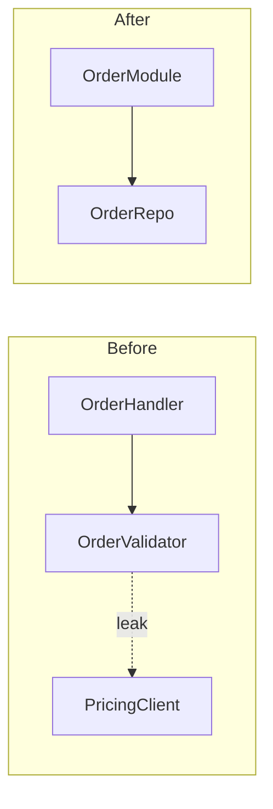

# Architecture Review — Surface & Deepen Shallow Modules

Find shallow modules in a target codebase and propose deepening refactors. Creates an **umbrella GitHub issue** listing all candidates with Mermaid diagrams, plus one **sub-issue per candidate** with full card (dependency category, testing strategy).

Requires: `gh` CLI authenticated.

## Usage

```
/architecture-review <target>
```

| Target              | What it analyzes                                |
| ------------------- | ----------------------------------------------- |
| `root` (or omitted) | Main repo                                       |
| `<submodule-name>`  | Submodule by name (resolved from `.gitmodules`) |
| `<any-path>`        | Arbitrary directory                             |

## Workflow

### 1 — Resolve target

Extract target from message:

- `/architecture-review <target>` → use directly
- Natural language: parse "of X", "in X", "for X", or single word matching submodule name or valid path
- If nothing matches, treat as `root`

Read `.gitmodules` from project root. Parse submodules. If target matches submodule name, resolve to its `path`. Otherwise treat as relative directory. For `root`, use `.`.

### 2 — Explore codebase

Use Pi tools to walk target:

- `structural_search` — symbol tree, function/class definitions, call chains, tightly-coupled patterns
- `ripgrep_search` — hardcoded strings, leaky dependencies, magic numbers
- `read` — inspect module interfaces directly
- `read` — inspect module interfaces directly

Note friction points:

- Where understanding requires bouncing between many small modules
- Where modules are **shallow** — interface nearly as complex as implementation
- Where pure functions extracted just for testability but real bugs hide in call patterns (no **locality**)
- Where tightly-coupled modules leak across **seams**
- Untested or hard-to-test interfaces

Apply **deletion test**: would deleting the module concentrate complexity or just move it? "Yes, concentrates" = signal.

### 3 — Create umbrella issue

Create one GitHub issue listing all candidates.

**Title:** `Architecture Review: <target-name> — <YYYY-MM-DD>`

**Labels:** Always `architecture`. If target is a submodule, also add submodule name as label (create with `gh label create <name>` if absent).

**Body structure:**

````markdown
## Candidates

### 1. <short title> [Strong]

**Files:** `path/to/file1.ts`

**Problem:** One sentence.
**Solution:** One sentence.
**Wins:** Bullets (≤6 words each) in glossary terms.


````

---

### 2. <short title> [Worth exploring]

...

## Top Recommendation

**<candidate name>** — one sentence why.

```

### 4 — Create sub-issues

Per candidate, create separate GitHub issue:
- **Title:** `ICA: <candidate short title>`
- **Body:** `Part of **Architecture Review: <target-name>** (#N)` + full card from umbrella plus:
  - **Dependency category** (see below)
  - **Testing strategy** — what old tests become waste, what new tests look like
- **Labels:** same as umbrella (`architecture` + submodule name)

### 5 — Link, board, complete

1. Comment on umbrella with table linking all sub-issues
2. Add all issues to project board with status `Research` (use `gh project item-edit` or GraphQL)
3. Print all issue URLs

> Architecture review filed. Umbrella: **#N**. Sub-issues: **#A**, **#B**. Use `/issue-refinement <number>` on any candidate, then `/supervisor <number>` to implement.

## Dependency categories

When classifying candidate dependencies for sub-issue:

| Category | Meaning | Testing approach |
|----------|---------|-----------------|
| **In-process** | Pure computation, no I/O | Test through new interface directly. No adapter needed. |
| **Local-substitutable** | Dependencies with local stand-ins (PGLite, in-memory FS) | Test with stand-in. Seam internal; no port at external interface. |
| **Remote but owned (Ports & Adapters)** | Your own services across network | Define port at seam. In-memory adapter for tests, HTTP/gRPC for prod. |
| **True external (Mock)** | Third-party (Stripe, Twilio) | Injected port; mock adapter in tests. |

**Seam discipline:** One adapter = hypothetical seam. Two adapters = real seam. Don't introduce port unless ≥2 adapters justified.

**Testing strategy:** Replace, don't layer. Old unit tests on shallow modules become waste once tests at deepened interface exist — delete them.

## Diagram patterns

Pick the pattern that fits the candidate:

- **flowchart LR/TB** — call flow, dependency arrows, red dashed line for leaks
- **sequenceDiagram** — round-trip reduction
- **Cross-section** — layered shallowness (stack horizontal bands)
- **Call-graph collapse** — before/after subgraph nesting

Style: `classDef leak stroke:#dc2626,stroke-width:2px,stroke-dasharray:4 4;`

## Glossary

Use these terms exactly in every suggestion. No substitutions.

| Term | Definition |
|------|-----------|
| **Module** | Anything with an interface and an implementation |
| **Interface** | Everything a caller must know (types, invariants, error modes, ordering, config) |
| **Implementation** | The code inside |
| **Depth** | Leverage at the interface — much behaviour behind a small interface |
| **Seam** | Where an interface lives; a place behaviour can be altered without editing in place |
| **Adapter** | Concrete thing satisfying an interface at a seam |
| **Leverage** | What callers get from depth |
| **Locality** | What maintainers get from depth |
| **Deletion test** | Imagine deleting the module. If complexity vanishes it was a pass-through. If complexity reappears across callers, it earned its keep |

**Never use:** component, service, unit (for module) · API, signature (for interface) · boundary (for seam) · layer, wrapper (for module, when you mean module).

**Wins bullets** name gain in glossary terms. Write "locality: bugs concentrate in one module", not "easier to maintain".

## Tone

Lean editorial. No hedging, no throat-clearing, no "it's worth noting". Sentence → bullet if possible. Bullet → cut if possible.
```
