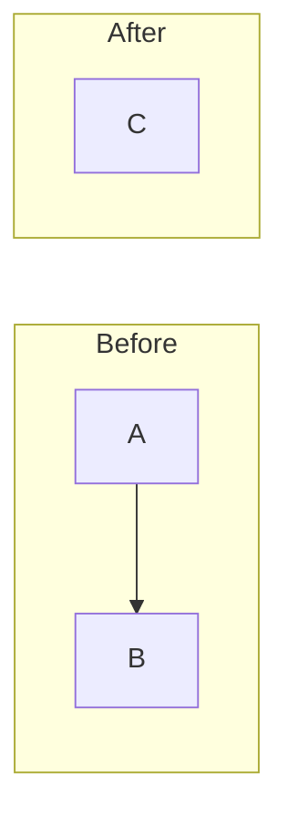

# Improve Codebase Architecture

Find shallow modules in a target codebase and propose deepening refactors. Creates an **umbrella GitHub issue** listing all candidates with Mermaid diagrams, plus one **sub-issue per candidate** with full card (dependency category, testing strategy).

## Setup

No setup needed. Reference files in `references/` are loaded on-demand.

Requires: `gh` CLI authenticated, `node`, npm packages already installed.

## Usage

```
/skill:improve-codebase-architecture <target>
```

| Target | What it analyzes |
|--------|-----------------|
| `root` (or omitted) | Main repo (agentcastle) |
| `<submodule-name>` | Submodule by name (resolved from `.gitmodules`) |
| `<any-path>` | Arbitrary directory |

## How It Works

1. **Resolve target** — Extract target from message, read `.gitmodules`, resolve to directory
2. **Explore** — Walk codebase with ranked_map, ripgrep_search, structural_search, read
3. **Create umbrella issue** — GitHub issue with all candidates (Mermaid diagrams, summary cards)
4. **Create sub-issues** — One per candidate with dependency category + testing strategy
5. **Link and board** — Comment on umbrella, add to project board
6. **Report** — Print all issue URLs

---

## 1. Resolve target

Two invocation paths. Handle both:

### Path A — Explicit `/skill:` command

If skill was invoked via `/skill:improve-codebase-architecture <target>`, the target appears as `User: <target>` in the message. Extract it directly.

### Path B — Natural language trigger

If invoked via natural language (e.g. "improve codebase architecture of flask_blogs"), extract target from the user's sentence. Parse for:
- "of <target>" — e.g. "architecture of flask_blogs", "review of tools/", "improve src/core"
- "in <target>" — e.g. "modules in extensions/"
- "for <target>" — e.g. "analysis for auth-module"
- Single word that matches a submodule name or valid path
- If nothing matches, treat as `root`

### Resolution

Read `.gitmodules` from project root. Parse submodules. If extracted target matches a submodule `name`, resolve to that submodule's `path`. Otherwise treat as relative directory from repo root.

If target resolves to `root` or omitted, use project root (`.`).

## 2. Explore

Use Pi tools to walk the target codebase:

- `ranked_map` — symbol tree: classes, functions, variables (omit query for full dump on small repos)
- `ripgrep_search` — hardcoded strings, magic numbers, leaky dependencies
- `structural_search` — call chains, tightly-coupled patterns, deep nesting
- `read` — inspect module interfaces directly

Explore organically. Note where you experience friction:

- Where does understanding one concept require bouncing between many small modules?
- Where are modules **shallow** — interface nearly as complex as the implementation?
- Where have pure functions been extracted just for testability, but the real bugs hide in how they're called (no **locality**)?
- Where do tightly-coupled modules leak across their seams?
- Which parts of the codebase are untested, or hard to test through their current interface?

Apply the **deletion test** to anything you suspect shallow: would deleting it concentrate complexity, or just move it? A "yes, concentrates" is the signal.

## 3. Create umbrella issue with all candidates

Create one umbrella GitHub issue listing all candidates.

**Issue title:** `Architecture Review: <target-name> — <YYYY-MM-DD>`

**Issue labels:** Always `architecture`. If target is a submodule (resolved from `.gitmodules`), also add the submodule name as a label — create it with `gh label create <name>` if it doesn't exist.

**Issue body (umbrella):** One candidate per `###` section with summary card (files, problem, solution, wins, Mermaid diagram) plus top recommendation at the end. See [HTML-REPORT.md](references/HTML-REPORT.md) for diagram patterns, style guidance, and vocabulary rules.

Issue template structure:
```markdown
## Candidates

### 1. <short title> [Strong]
**Files:** `path/to/file1.py`
**Problem:** One sentence.
**Solution:** One sentence.
**Wins:** Bullets in glossary terms.

[mermaid diagram]

---

### 2. <short title> [Worth exploring]
...

## Top Recommendation
...
```

For Mermaid diagrams use fenced code block with `mermaid` language:
~~~markdown

~~~

## 4. Create one sub-issue per candidate

For each candidate, create a separate GitHub issue with its **full card** — everything from the umbrella entry plus:
- **Dependency category** (from [DEEPENING.md](references/DEEPENING.md)) — e.g. `in-process`, `local-substitutable`, `ports & adapters`, `mock`
- **Testing strategy** — what old tests become waste, what new tests look like, where the test surface sits
- Title prefix: `ICA: <candidate short title>`
- Body begins: `Part of **Architecture Review: <target-name>** (#N)` where N is the umbrella issue number
- Same labels as umbrella (`architecture` + submodule name)

## 5. Link and board

1. Comment on umbrella issue with table listing all sub-issues
2. Add all issues (umbrella + sub-issues) to project board with status `Research`
3. Use `gh project item-edit` or GraphQL mutation to set status field

## 6. Completion

Print all issue URLs. Tell the user:

> Architecture review filed. Umbrella: **#N**. Sub-issues: **#A**, **#B**, **#C**, **#D**. Use `/issue-refinement <number>` on any candidate, then `/supervisor <number>` to implement.

## Glossary

Use these terms exactly in every suggestion.

| Term | Definition |
|------|-----------|
| **Module** | Anything with an interface and an implementation |
| **Interface** | Everything a caller must know (types, invariants, error modes, ordering, config) |
| **Implementation** | The code inside |
| **Depth** | Leverage at the interface — much behaviour behind a small interface |
| **Seam** | Where an interface lives; a place behaviour can be altered without editing in place |
| **Adapter** | Concrete thing satisfying an interface at a seam |
| **Leverage** | What callers get from depth |
| **Locality** | What maintainers get from depth |
| **Deletion test** | Imagine deleting the module. If complexity vanishes it was a pass-through. If complexity reappears across callers, it earned its keep |

## Reference files

- [DEEPENING.md](references/DEEPENING.md) — Dependency categories (in-process, local-substitutable, ports & adapters, mock), seam discipline, testing strategy
- [HTML-REPORT.md](references/HTML-REPORT.md) — Report format, diagram patterns (flowchart, sequence, cross-section, mass, call-graph collapse), style guidance, tone rules
