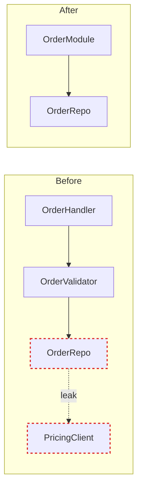
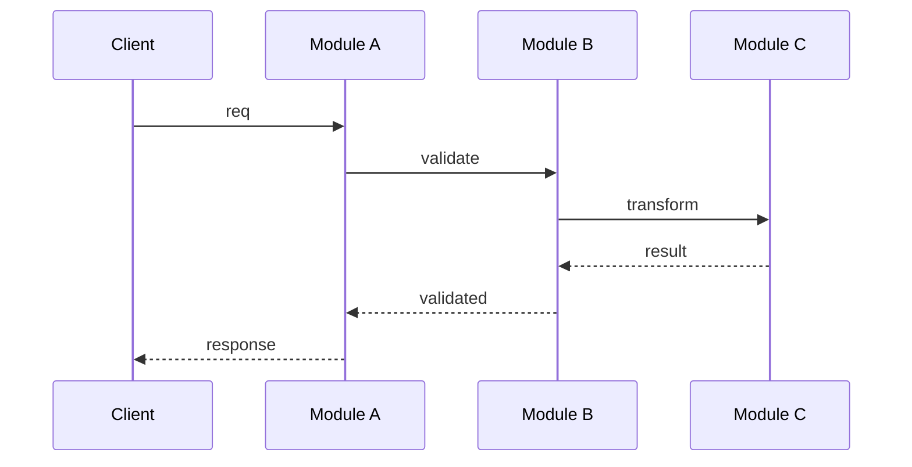

# Report Format (GitHub Issue)

The architecture review is filed as a GitHub issue. Markdown body with Mermaid diagrams for visual structure. GitHub renders Mermaid natively in fenced blocks.

## Issue metadata

- **Title:** `Architecture Review: <target-name> — <YYYY-MM-DD>`
- **Label:** `architecture` (create with `gh label create architecture` if absent)
- **Project status:** `Research` (if supervisor config exists)

## Scaffold

```markdown
## Candidates

### 1. <short title> [Strong]

**Files:** `path/to/file1.ts`, `path/to/file2.ts`

**Problem:** One sentence.
**Solution:** One sentence.
**Wins:** Bullets (≤6 words each) in glossary terms.

**Before / After**

[mermaid diagram]

---

### 2. <short title> [Worth exploring]

...

## Top Recommendation

**<candidate name>** — one sentence why. Anchor link to its section.
```

## Header format

Target name, date, and a compact legend in prose: "Box = module, dashed line = seam, red arrow = leakage, thick box = deep module." No intro paragraph — straight into candidates.

## Candidate card

Each candidate is a `###` section:

- **Title** — short, names the deepening (e.g. "Collapse the Order intake pipeline").
- **Badge** — in heading brackets: `[Strong]` (emerald), `[Worth exploring]` (amber), `[Speculative]` (slate).
- **Files** — inline code, comma-separated.
- **Before / After diagram** — the centrepiece. Two Mermaid subgraphs side by side. See patterns below.
- **Problem** — one sentence.
- **Solution** — one sentence.
- **Wins** — bullets, ≤6 words each. e.g. "Tests hit one interface", "Pricing logic stops leaking", "Delete 4 shallow wrappers".
- **ADR callout** (if applicable) — blockquote in amber: `> ⚠️ Contradicts ADR-0007 — worth reopening because…`

No paragraphs of explanation. If the diagram needs a paragraph, redraw the diagram.

## Diagram patterns

Pick the pattern that fits the candidate. Mix them.

### Mermaid flowchart (workhorse for dependencies / call flow)

Use `flowchart LR` or `flowchart TB` when the point is "X calls Y calls Z." Style leakage edges red with `classDef`.



### Sequence diagram (good for round-trip reduction)



### Cross-section (layered shallowness)

Stack horizontal bands to show layers a call passes through. Before: 6 thin layers each doing nothing. After: 1 thick band labelled with the consolidated responsibility. Use a Mermaid `block` or nested subgraphs.

### Mass diagram (interface vs implementation size)

Two rectangles per module — one for interface surface area, one for implementation. Before: interface rectangle nearly as tall as implementation (shallow). After: interface rectangle short, implementation rectangle tall (deep). Use a table or inline SVG rendered as Unicode/ASCII art.

### Call-graph collapse

Before: a tree of modules rendered as nested subgraphs. After: the same tree collapsed into one subgraph, with now-internal calls shown faded inside it.

## Style guidance

- Lean editorial, not corporate. Generous whitespace between sections.
- Colour sparingly: emerald for `[Strong]`, amber for warnings, red for leakage edges.
- Use `[Badge]` in heading — GitHub renders as plain text but the bracket convention makes them scannable.
- ADR callouts as blockquotes with `⚠️` prefix.
- Mermaid diagrams ~320px tall (default render height) so before/after sits comfortably side by side.

## Top recommendation section

One section at the end. Candidate name, one sentence on why, anchor link to its heading.

```markdown
## Top Recommendation

**[Collapse the Order intake pipeline](#1-collapse-the-order-intake-pipeline-strong)** — highest leverage: one interface replaces four, deletes 3 wrappers, makes pricing logic testable in place.
```

## Tone

Plain English, concise — but the architectural nouns and verbs come straight from the glossary below. Concision is not an excuse to drift.

**Use exactly:** module, interface, implementation, depth, deep, shallow, seam, adapter, leverage, locality.

**Never substitute:** component, service, unit (for module) · API, signature (for interface) · boundary (for seam) · layer, wrapper (for module, when you mean module).

**Phrasings that fit the style:**

- "Order intake module is shallow — interface nearly matches the implementation."
- "Pricing leaks across the seam."
- "Deepen: one interface, one place to test."
- "Two adapters justify the seam: HTTP in prod, in-memory in tests."

**Wins bullets** name the gain in glossary terms: _"locality: bugs concentrate in one module"_, _"leverage: one interface, N call sites"_, _"interface shrinks; implementation absorbs the wrappers"_. Don't write _"easier to maintain"_ or _"cleaner code"_ — those terms aren't in the glossary.

No hedging, no throat-clearing, no "it's worth noting that…". If a sentence could be a bullet, make it a bullet. If a bullet could be cut, cut it. If a term isn't in the glossary, reach for one that is before inventing a new one.
